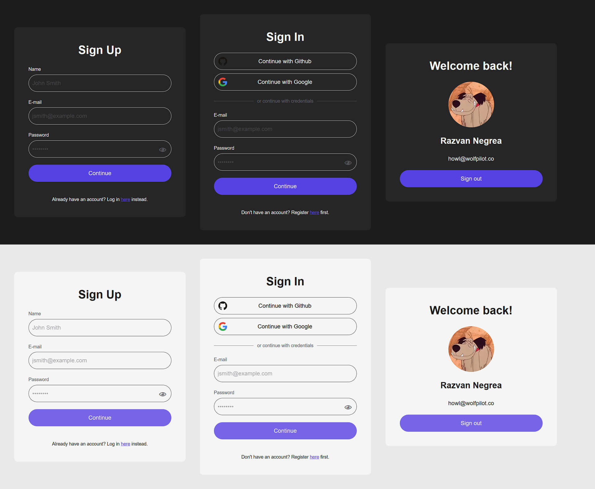
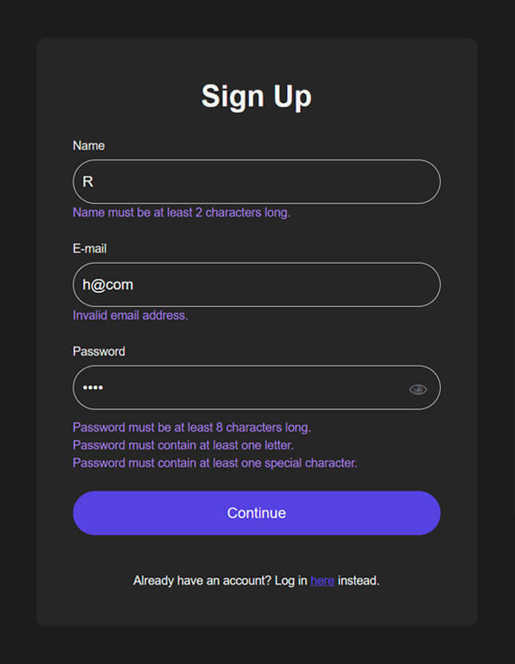

# OAuth2 SSO Dashboard

Log in with your favourite SSO provider (Google, Github, etc.) or sign up using the good ol' email & password, provided courtesy of Auth.js (aka NextAuth.js v5) with some tweaks here and there.

Built using Next.js with Zod for request validation, PostgresQL DB and Kysely ORM.

## Table of contents

- [Intro](#intro)
- [Demo](#demo)
- [Features (done)](#features-done)
- [Features (TBA)](#features-tba)
- [Technologies](#technologies)
- [API](#api)
- [Security](#security)
- [Getting started](#getting-started)
- [Notes to Self](#notes-to-self)
- [Resources](#resources)
- [License](#license)

## Intro

_But, but where's the dashboard?_

Ok, the cake is a lie. There is however some of your own data that displays when you log in, which you can see in action below. It's an MVP after all.



## Demo

- Homepage: [https://wolfpilot-oauth2-sso-dashboard.vercel.app/](https://wolfpilot-oauth2-sso-dashboard.vercel.app/)
- Sign In Page: [https://wolfpilot-oauth2-sso-dashboard.vercel.app/sign-in](https://wolfpilot-oauth2-sso-dashboard.vercel.app/sign-in)
- Sign Up Page: [https://wolfpilot-oauth2-sso-dashboard.vercel.app/sign-up](https://wolfpilot-oauth2-sso-dashboard.vercel.app/sign-up)
- Dashboard: [https://wolfpilot-oauth2-sso-dashboard.vercel.app/dashboard](https://wolfpilot-oauth2-sso-dashboard.vercel.app/dashboard)

## Features (done)

- UI/UX

  - Light & dark OS themes
  - Randomly generated avatar colours for credentials login
  - Password visibility toggle

- Authentication

  - Sign up/in via SSO providers or credentials
  - Validation using Zod
  - Server actions

- Database

  - PostgresQL DB
  - Script for generating DB schemas
  - Password hashing
  - Cron job for cleaning up expired user sessions once per day

- Config

  - Import path aliases using tsconfig-paths
  - Localised .env files using dotenv-flow

- CI/CD

  - Github Actions workflow
  - Restricted master branch merge only on pipeline pass



## Features (TBA)

- [x] Randomly generated avatar for credentials signup
- [ ] Sign in using magic links
- [ ] Rate limits for API endpoints
- [ ] Account lockout on 3x failed login attempts

## Technologies

- Languages
  - [TypeScript](https://www.typescriptlang.org/)
- Frameworks
  - [Next.js](https://nextjs.org/)
- Database
  - [PostgreSQL](https://www.postgresql.org/)
  - [Neon](https://neon.tech/)
  - [Kysely](https://kysely.dev/)
- Validation
  - [Zod](https://zod.dev/)
- Config
  - [tsconfig-paths](https://www.npmjs.com/package/tsconfig-paths)
  - [dotenv-flow](https://www.npmjs.com/package/dotenv-flow)
  - [cross-env](https://github.com/kentcdodds/cross-env)
- Linting & formatting
  - [EsLint](https://eslint.org/)
  - [Prettier](https://prettier.io/)
- Testing
  - [Vitest](https://vitest.dev/)
  - [Playwright](https://playwright.dev/)
- CI/CD
  - [Husky](https://www.npmjs.com/package/husky)
    - Pre-commit
    - Pre-push
  - [Github Actions](https://docs.github.com/en/actions)
    - Setting up PG database
    - Running migrations
    - Running unit & E2E tests
    - Etc.
  - [Act](https://github.com/nektos/act)
    - Simulate Github Actions locally
  - [Vercel](https://vercel.com)
    - Hosting webapp

## API

### Endpoints

```
# Sessions
  GET    /sessions/clear                                 - clear expired user sessions
```

### Examples

Simply copy-paste the following examples in your bash terminal making sure to separate newlines with "\\" on Mac or "^" on Windows.

#### Delete all expired user sessions

- GET /sessions/clear

```bash
# Daily cron job called by Vercel as a GET method.
  curl \
  --location 'http://localhost:3000/api/sessions/clear' \
  --header 'Authorization: Bearer <process.env.CRON_SECRET>'
```

## Security

As always in these types of applications, security - even for a personal side-project like this one - is paramount. Some of the most common vectors of attack:

- SQL injection: prevented by default since Kysely treats input as data, rather than executable SQL.
- XSS: prevented by default given that React escapes special characters.
- DDOS: With a relatively restricted API, the only realistic vulnerabilities I can think of are:
  - The `/sessions/clear` endpoint. Since it's being called on a daily basis as part of a Vercel cron job, the handler checks whether a `CRON_SECRET` is provided as bearer token in the authorization headers. For more info, see Vercel's [recommendation](https://vercel.com/docs/cron-jobs/manage-cron-jobs).
  - Spamming new sign ups and logins. Unfortunately Auth.js doesn't provide any measures against this by itself. For a robust solution, one would need to implement a combination of rate limiting, account lockout on X failed attempts and CAPTCHAs, and although it would be nice, it's quite outside of the scope of this project.

## Getting started

### Requirements

- [Node.js](https://nodejs.org/en/) (built on v20.0.14)
- [Pnpm](https://pnpm.io/) (built on v9.14.2)
- [Docker](https://www.docker.com/) (built on v27.3.1)

### Installation

```bash
# 1. Clone the repo
$ git clone https://github.com/wolfpilot/oauth2-sso-dashboard.git
$ cd oauth2-sso-dashboard

# 2. Prepare your environment.
# - Copy the .env.example to .env or .env.local
# - Fill in the values as required

# 3. Install dependencies.
$ pnpm install

# 4. Set up container.
# - Open up your Docker desktop app.
# - Start your services.
$ docker compose up -d

# 5. Start your webapp.
$ pnpm dev
```

To view your app, go to [http://localhost:3000/](http://localhost:3000/). Additionally, you can check out your DB using the containerised pgAdmin tool at [http://localhost:8080/](http://localhost:8080/).

## Notes to Self

To simulate Github Action workflows, check out [Act](https://github.com/nektos/act).

```bash
# @see https://github.com/nektos/act/issues/329#issuecomment-1187246629
$ act --artifact-server-path /tmp/artifacts push
```

## Resources

### Guides

#### Auth.js official docs

- Setting up [pre-configured OAuth providers](https://authjs.dev/getting-started/authentication/oauth)
- Extending default schema with [Typescript](https://authjs.dev/getting-started/typescript)
- Using the [Kysely adapter](https://authjs.dev/getting-started/adapters/kysely)

The official documentation can be a bit of a mess; here are some other resources that helped me along the way.

#### Videos

- Jackson Zheng's full course on [How to set up Email Authentication + Google OAuth in Next.js 14](https://www.youtube.com/watch?v=TLGFTH4s_0Y)
- Hudson Yuen on [E2E testing and CI/CD with Next.js + Auth](https://www.youtube.com/watch?v=kD1jjfwer5Y&list=PLfAtdFxJ6RK_PYq--nUlSqOxh3vtF8DV4&index=11)

#### Articles

- Ejiro Asiuwhu's [How to use Auth.js for client-side authentication in Next.js](https://blog.logrocket.com/auth-js-client-side-authentication-next-js/)
- Yu Hamada [How to use Auth.js for client-side authentication in Next.js](https://dev.to/jamescroissant/user-authentication-with-authjs-in-nextjs-app-router-424k)
- Gift Uhiene's [How to Validate Forms with Zod and React-Hook-Form](https://www.freecodecamp.org/news/react-form-validation-zod-react-hook-form/)

## License

This project is licensed under the [MIT License](LICENSE).
